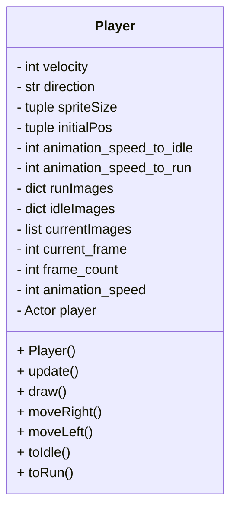

# Samurai assault
A pgzero game

```mermaid
classDiagram
    class Player {
        - int velocity
        - str direction
        - tuple spriteSize
        - tuple initialPos
        - int animation_speed_to_idle
        - int animation_speed_to_run
        - dict runImages
        - dict idleImages
        - list currentImages
        - int current_frame
        - int frame_count
        - int animation_speed
        - Actor player
        + Player()
        + update()
        + draw()
        + moveRight()
        + moveLeft()
        + toIdle()
        + toRun()
    }
```
