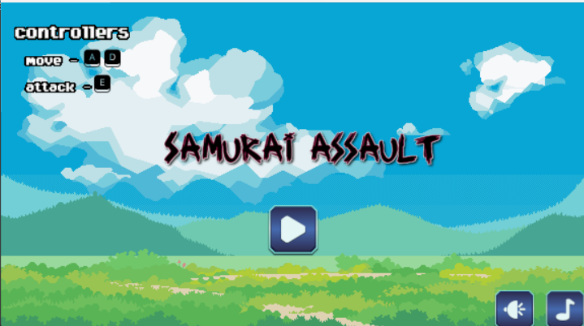

# Samurai assault
A pgzero game

<p align="center">
  
  
</p>


## How to play?
### 1️⃣ Install python
Check if you have python installed on your machine. (version 3.7 or higher)
You can see you version by running:
```shell
python --version
```
or
```shell
python3 --version
```

### 2️⃣ Install PgZero
To run this project it's essential that you have PgZero installed.
```shell
pip install pgzero
```

### 3️⃣ Clone the Repository
You can clone this repository with the following command:
```shell
git clone https://github.com/kei4ss/Samurai-assault.git
```
or you can click [here](https://github.com/kei4ss/Samurai-assault/archive/refs/heads/main.zip) to download zip.

### Run the game
Open src directory and run with the following command:
```bash
python Main.py
```
or

```bash
python3 Main.py
```
or
```bash
pgzrun Main.py
```
