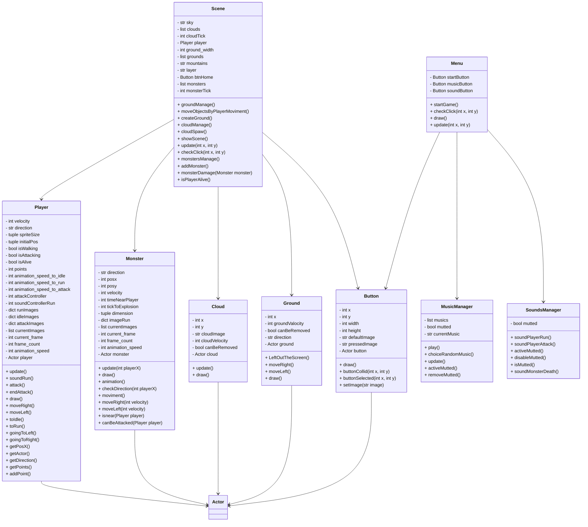

## class diagram

```mermaid
classDiagram
    class Player {
        - int velocity
        - str direction
        - tuple spriteSize
        - tuple initialPos
        - bool isWalking
        - bool isAttacking
        - bool isAlive
        - int points
        - int animation_speed_to_idle
        - int animation_speed_to_run
        - int animation_speed_to_attack
        - int attackController
        - int soundControllerRun
        - dict runImages
        - dict idleImages
        - dict attackImages
        - list currentImages
        - int current_frame
        - int frame_count
        - int animation_speed
        - Actor player
        + update()
        + soundRun()
        + attack()
        + endAttack()
        + draw()
        + moveRight()
        + moveLeft()
        + toIdle()
        + toRun()
        + goingToLeft()
        + goingToRight()
        + getPosX()
        + getActor()
        + getDirection()
        + getPoints()
        + addPoint()
    }

    class Monster {
        - str direction
        - int posx
        - int posy
        - int velocity
        - int timeNearPlayer
        - int tickToExplosion
        - tuple dimension
        - dict imageRun
        - list currentImages
        - int current_frame
        - int frame_count
        - int animation_speed
        - Actor monster
        + update(int playerX)
        + draw()
        + animation()
        + checkDirection(int playerX)
        + moviment()
        + moveRight(int velocity)
        + moveLeft(int velocity)
        + isnear(Player player)
        + canBeAttacked(Player player)
    }

    class Cloud {
        - int x
        - int y
        - str cloudImage
        - int cloudVelocity
        - bool canBeRemoved
        - Actor cloud
        + update()
        + draw()
    }

    class Ground {
        - int x
        - int groundValocity
        - bool canBeRemoved
        - str direction
        - Actor ground
        + LeftOutTheScreen()
        + moveRight()
        + moveLeft()
        + draw()
    }

    class Scene {
        - str sky
        - list clouds
        - int cloudTick
        - Player player
        - int ground_width
        - list grounds
        - str mountains
        - str layer
        - Button btnHome
        - list monsters
        - int monsterTick
        + groundManage()
        + moveObjectsByPlayerMoviment()
        + createGround()
        + cloudManage()
        + cloudSpaw()
        + showScene()
        + update(int x, int y)
        + checkClick(int x, int y)
        + monstersManage()
        + addMonster()
        + monsterDamage(Monster monster)
        + isPlayerAlive()
    }

    class Button {
        - int x
        - int y
        - int width
        - int height
        - str defaultImage
        - str pressedImage
        - Actor button
        + draw()
        + buttonCollid(int x, int y)
        + buttonSelected(int x, int y)
        + setImage(str image)
    }

    class Menu {
        - Button startButton
        - Button musicButton
        - Button soundButton
        + startGame()
        + checkClick(int x, int y)
        + draw()
        + update(int x, int y)
    }

    class MusicManager {
        - list musics
        - bool mutted
        - str currentMusic
        + play()
        + choiceRandomMusic()
        + update()
        + activeMutted()
        + removeMutted()
    }

    class SoundsManager {
        - bool mutted
        + soundPlayerRun()
        + soundPlayerAttack()
        + activeMutted()
        + disableMutted()
        + isMutted()
        + soundMonsterDeath()
    }

    Player --> Actor
    Monster --> Actor
    Cloud --> Actor
    Ground --> Actor
    Scene --> Player
    Scene --> Ground
    Scene --> Cloud
    Scene --> Monster
    Scene --> Button
    Button --> Actor
    Menu --> Button
    Menu --> MusicManager 
    Menu --> SoundsManager

```