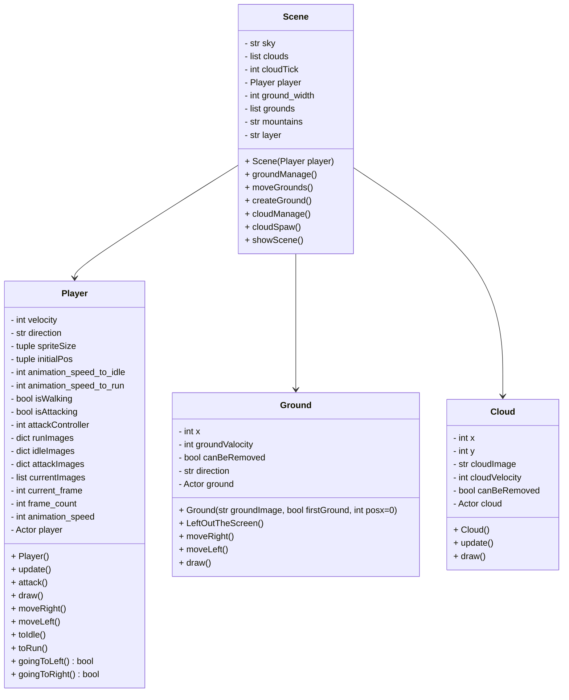

## class diagram

```mermaid
classDiagram
    class Player {
        - int velocity
        - str direction
        - tuple spriteSize
        - tuple initialPos
        - int animation_speed_to_idle
        - int animation_speed_to_run
        - bool isWalking
        - bool isAttacking
        - int attackController
        - dict runImages
        - dict idleImages
        - dict attackImages
        - list currentImages
        - int current_frame
        - int frame_count
        - int animation_speed
        - Actor player
        + Player()
        + update()
        + attack()
        + draw()
        + moveRight()
        + moveLeft()
        + toIdle()
        + toRun()
        + goingToLeft() bool
        + goingToRight() bool
    }

    class Cloud {
        - int x
        - int y
        - str cloudImage
        - int cloudVelocity
        - bool canBeRemoved
        - Actor cloud
        + Cloud()
        + update()
        + draw()
    }

        class Ground {
        - int x
        - int groundValocity
        - bool canBeRemoved
        - str direction
        - Actor ground
        + Ground(str groundImage, bool firstGround, int posx=0)
        + LeftOutTheScreen()
        + moveRight()
        + moveLeft()
        + draw()
    }

        class Scene {
        - str sky
        - list clouds
        - int cloudTick
        - Player player
        - int ground_width
        - list grounds
        - str mountains
        - str layer
        + Scene(Player player)
        + groundManage()
        + moveGrounds()
        + createGround()
        + cloudManage()
        + cloudSpaw()
        + showScene()
    }

    Scene --> Player
    Scene --> Ground
    Scene --> Cloud
```